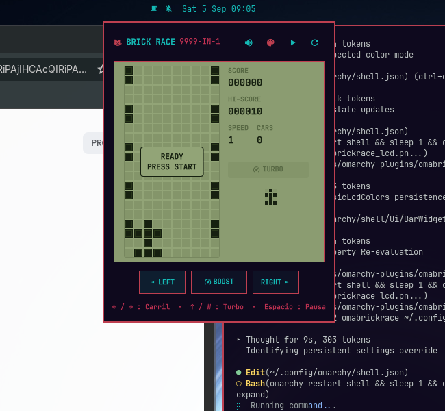

# OmaBrickRace 🏎️

A faithful replica of the classic **9999-in-1 LCD Brick Game Car Racing** game (E-9999 handhelds) built as a native status bar plugin for **Omarchy** (Quickshell / Hyprland).

## Features

- 🏎️ **Authentic 10×20 LCD Matrix**: Exact 3×4 brick race cars, scrolling dotted road borders, and liquid crystal styling with ghost background segments.
- 🚀 **Turbo Boost**: Hold `↑` or `W` to accelerate to 2.5× speed and rack up double points!
- 🔊 **8-bit Retro Sounds**: Nostalgic 1-bit sound effects for steering, passing cars, turbo revs, crashes, and game over. Includes sound mute toggle (`M`).
- 🎨 **Dual Display Modes**: Toggle between authentic LCD Olive Green and your active Omarchy theme colors (`C`).
- 🏆 **Score & Level Progression**: Digital 6-digit score, speed/level progression, and automatic best-score persistence in Omarchy shell settings.
- 🎮 **Keyboard & Mouse Support**: Play with Arrow keys / WASD or click the on-screen arcade buttons.
- 🔌 **IPC Integration**: Open, close, or toggle via `omarchy shell ipc` / `qmsg`.

## Controls

| Key | Action |
| :--- | :--- |
| `←` / `A` / `H` | Steer to Left Lane |
| `→` / `D` / `L` | Steer to Right Lane |
| `↑` / `W` / `K` | Turbo Boost (Hold) |
| `Space` / `Enter` | Start Game / Pause / Restart |
| `P` | Pause / Resume |
| `R` | Restart Game |
| `M` | Mute / Unmute 8-bit Audio |
| `C` | Toggle LCD Green / Theme Palette |
| `Esc` | Close Panel |

## License

MIT
